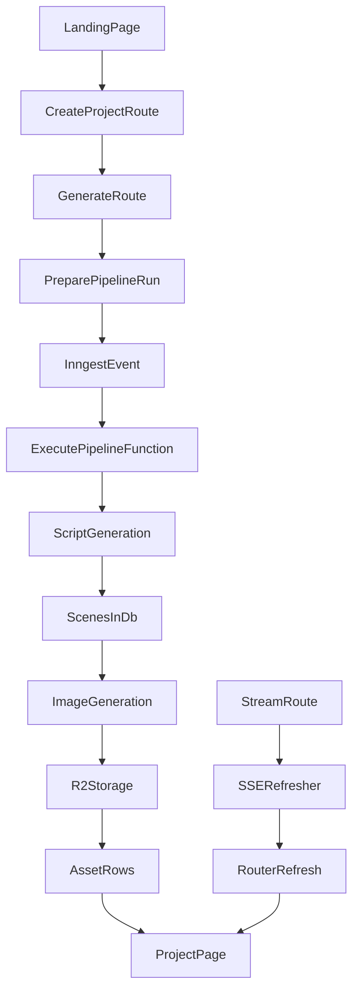

# Movie Machine Codebase Explainer

This document is an interview-focused guide to how Movie Machine works. It explains the important files, the routes, the backend infrastructure, the UI flow, and the reasons the code is structured this way.

If you need a one-sentence summary:

> Movie Machine is a Next.js App Router app that lets a user submit a movie idea, stores that project in Postgres via Prisma, kicks off background generation through Inngest, writes screenplay scenes with OpenAI, generates storyboard frames with Gemini, stores those images in Cloudflare R2, and keeps the project page updated through an SSE stream that triggers `router.refresh()`.

## What The Product Does

The app turns a movie idea into:

1. A short screenplay broken into scenes.
2. A storyboard image for each scene.
3. A project page that updates while generation is happening.

Today, the implemented product stops at script + storyboard frames. The schema and UI mention audio generation and final assembly, but those stages are intentionally skipped in the current code.

## The Big Picture

## Core Architecture

Movie Machine is built from five main layers:

| Layer | Main files | What it does | Why it exists |
| --- | --- | --- | --- |
| App shell and pages | [`../src/app/layout.tsx`](../src/app/layout.tsx), [`../src/app/page.tsx`](../src/app/page.tsx), [`../src/app/projects/[id]/page.tsx`](../src/app/projects/[id]/page.tsx) | Renders the landing page and project page with server-side data. | Keeps the UI simple and makes the database the source of truth. |
| API routes | [`../src/app/api/projects/route.ts`](../src/app/api/projects/route.ts), [`../src/app/api/projects/[id]/generate/route.ts`](../src/app/api/projects/[id]/generate/route.ts), [`../src/app/api/projects/[id]/status/route.ts`](../src/app/api/projects/[id]/status/route.ts), [`../src/app/api/projects/[id]/stream/route.ts`](../src/app/api/projects/[id]/stream/route.ts), [`../src/app/api/assets/[id]/route.ts`](../src/app/api/assets/[id]/route.ts), [`../src/app/api/inngest/route.ts`](../src/app/api/inngest/route.ts) | Accepts user actions, exposes project state, serves assets, and hosts the Inngest endpoint. | Separates short HTTP requests from long-running work. |
| Domain and orchestration | [`../src/lib/pipeline.ts`](../src/lib/pipeline.ts) | Creates pipeline runs, claims work, calls AI services, writes scenes/assets, finalizes and fails runs. | This is the real backend heart of the app. |
| Persistence and storage | [`../src/lib/db.ts`](../src/lib/db.ts), [`../prisma/schema.prisma`](../prisma/schema.prisma), [`../src/lib/storage.ts`](../src/lib/storage.ts) | Stores structured project data in Postgres and image bytes in Cloudflare R2. | Keeps metadata queryable in SQL and binary assets in object storage. |
| Background execution | [`../src/inngest/client.ts`](../src/inngest/client.ts), [`../src/inngest/functions.ts`](../src/inngest/functions.ts), [`../src/app/api/inngest/route.ts`](../src/app/api/inngest/route.ts) | Runs the pipeline outside the original request using Inngest checkpoints and retries. | Prevents slow AI work from blocking request/response cycles. |

## Repository Map

These are the important top-level files and folders.

| Path | What it does | Why it matters |
| --- | --- | --- |
| [`../package.json`](../package.json) | Declares scripts and dependencies. | Tells you the stack immediately: Next 16, React 19, Prisma 7, Inngest, OpenAI, Gemini, Postgres, AWS S3 SDK for R2. |
| [`../package-lock.json`](../package-lock.json) | Locks dependency versions. | Important for reproducible installs and deployments, but not where product logic lives. |
| [`../tsconfig.json`](../tsconfig.json) | TypeScript config. | The `@/*` alias points at `src/*`, which explains imports like `@/lib/pipeline`. |
| [`../next.config.ts`](../next.config.ts) | Next config. | Currently minimal, so most behavior comes from framework defaults. |
| [`../next-env.d.ts`](../next-env.d.ts) | Next-generated type reference file. | Supporting infrastructure rather than hand-written logic. |
| [`../eslint.config.mjs`](../eslint.config.mjs) | ESLint setup. | Governs lint behavior for the TypeScript/Next codebase. |
| [`../postcss.config.mjs`](../postcss.config.mjs) | PostCSS and Tailwind wiring. | Supports the styling pipeline behind the UI. |
| [`../prisma/schema.prisma`](../prisma/schema.prisma) | Data model definitions. | Defines the actual business entities and pipeline statuses. |
| [`../prisma.config.ts`](../prisma.config.ts) | Prisma CLI config. | Tells Prisma where the schema is and which DB URL to use for migrations. |
| [`../prisma/migrations`](../prisma/migrations) | SQL migration history. | Shows how the schema evolved and is what actually changes the database structure. |
| [`../src/app`](../src/app) | App Router pages, route handlers, and shared app components. | Contains the UI entry points and API routes. |
| [`../src/lib`](../src/lib) | Shared backend logic and service clients. | Contains the orchestration and infrastructure code that powers the app. |
| [`../src/inngest`](../src/inngest) | Inngest client and functions. | Connects the app to background execution. |
| [`../src/app/generated/prisma`](../src/app/generated/prisma) | Generated Prisma client output. | Important to understand, but not hand-written code. |
| [`../README.md`](../README.md) | Default Create Next App README. | Not the real architecture doc for this project. |
| [`../public`](../public) | Static assets, if any. | Not central to the current product flow. |

## Data Model: What Lives In The Database

The schema in [`../prisma/schema.prisma`](../prisma/schema.prisma) defines the language of the app.

### Main models

| Model | What it stores | Why it exists |
| --- | --- | --- |
| `User` | Basic user record with `email` and `name`. | Projects belong to a user. |
| `Project` | A movie idea with `title`, `prompt`, `status`, and `userId`. | This is the top-level unit the product revolves around. |
| `Scene` | Ordered screenplay scenes for a project. | Lets the app show script beats and attach image assets to each scene. |
| `PipelineRun` | One execution attempt for a project. | A project can be retried, so runs are separate from the project itself. |
| `PipelineStep` | One step inside a run, like script or image generation. | Makes progress observable and recoverable. |
| `Asset` | Generated files such as images. | Stores file metadata and links assets back to scenes and steps. |

### Status enums

| Enum | Values | Meaning |
| --- | --- | --- |
| `ProjectStatus` | `DRAFT`, `GENERATING`, `COMPLETED`, `FAILED` | Overall project lifecycle. |
| `PipelineStatus` | `PENDING`, `RUNNING`, `COMPLETED`, `FAILED` | Status of a single pipeline run. |
| `StepStatus` | `PENDING`, `RUNNING`, `COMPLETED`, `FAILED`, `SKIPPED` | Status of each pipeline step. |
| `StepType` | `SCRIPT_GENERATION`, `IMAGE_GENERATION`, `AUDIO_GENERATION`, `ASSEMBLY` | The fixed stages of the generation pipeline. |
| `AssetType` | `SCRIPT`, `IMAGE`, `AUDIO`, `VIDEO` | The kind of generated asset. |

### Why the schema is structured this way

The schema is built around observability and retries:

- `Project` is the user-facing object.
- `PipelineRun` represents one attempt to generate that project.
- `PipelineStep` breaks the attempt into small trackable stages.
- `Asset` lets generated files be stored independently from relational data.

That design is what makes the progress UI possible. The page does not need to guess what is happening. It can simply read pipeline rows and render their current status.

## Route Inventory

These are the key route handlers and what they do.

| Route | Method | File | What it does | Why it exists |
| --- | --- | --- | --- | --- |
| `/api/projects` | `POST` | [`../src/app/api/projects/route.ts`](../src/app/api/projects/route.ts) | Creates a new project from `title`, `prompt`, and `userId`. | Entry point when the user submits the form. |
| `/api/projects` | `GET` | [`../src/app/api/projects/route.ts`](../src/app/api/projects/route.ts) | Lists projects for a `userId`. | Useful for fetching project history, even though the current UI does not emphasize it. |
| `/api/projects/[id]` | `GET` | [`../src/app/api/projects/[id]/route.ts`](../src/app/api/projects/[id]/route.ts) | Returns the full project with scenes, runs, steps, and assets. | Debug-friendly and useful for clients that need the whole graph. |
| `/api/projects/[id]/generate` | `POST` | [`../src/app/api/projects/[id]/generate/route.ts`](../src/app/api/projects/[id]/generate/route.ts) | Prepares a pipeline run and sends the Inngest event `pipeline/execute`. | Starts generation without doing the heavy work inline. |
| `/api/projects/[id]/status` | `GET` | [`../src/app/api/projects/[id]/status/route.ts`](../src/app/api/projects/[id]/status/route.ts) | Returns a summarized status payload with a `version` string and scene counts. | Supports polling and also performs stuck-run recovery with `after()`. |
| `/api/projects/[id]/stream` | `GET` | [`../src/app/api/projects/[id]/stream/route.ts`](../src/app/api/projects/[id]/stream/route.ts) | Opens an SSE stream that emits a new payload when project state changes. | Keeps the project page fresh without manual reloads. |
| `/api/assets/[id]` | `GET` | [`../src/app/api/assets/[id]/route.ts`](../src/app/api/assets/[id]/route.ts) | Reads an asset from R2 and returns its bytes. | Lets the UI fetch images through the app instead of directly from storage. |
| `/api/inngest` | `GET`, `POST`, `PUT` | [`../src/app/api/inngest/route.ts`](../src/app/api/inngest/route.ts) | Hosts the Inngest serve handler. | This is how Inngest reaches the app to run jobs. |

## End-To-End Lifecycle: How One Movie Gets Made

This is the sequence you should be able to explain out loud in an interview.

### 1. The user lands on `/`

The landing page lives in [`../src/app/page.tsx`](../src/app/page.tsx).

What it does:

- Server-renders the home screen.
- Upserts a hardcoded test user with email `test@movie-machine.app`.
- Passes that `userId` into the client form component.

Why it does this:

- The app needs a user ID to create a project.
- There is no real auth flow yet, so the page creates a simple placeholder user.

How it helps Movie Machine:

- It gives the rest of the system a stable `userId` without implementing auth first.

### 2. The user submits the project form

The form lives in [`../src/app/components/CreateProjectForm.tsx`](../src/app/components/CreateProjectForm.tsx).

What it does:

- Collects `title` and `prompt`.
- Calls `POST /api/projects`.
- Then immediately calls `POST /api/projects/{id}/generate`.
- Redirects to `/projects/{id}`.

Why it does this:

- The product wants the user to move from idea submission straight into generation.

How it helps Movie Machine:

- This is the UI bridge from user input to the backend pipeline.

### 3. The app creates a `Project`

This happens in [`../src/app/api/projects/route.ts`](../src/app/api/projects/route.ts).

What it does:

- Reads JSON from the request body.
- Requires `title`, `prompt`, and `userId`.
- Inserts a `Project` row with default status `DRAFT`.

Why it does this:

- The project must exist before generation can be tracked against it.

How it helps Movie Machine:

- It creates the durable root record that everything else hangs off.

### 4. The app starts generation

This happens in [`../src/app/api/projects/[id]/generate/route.ts`](../src/app/api/projects/[id]/generate/route.ts).

What it does:

- Looks up the project.
- Calls `preparePipelineRun(id)`.
- Sends an Inngest event:
  - `name: 'pipeline/execute'`
  - `data: { runId: pipelineRun.id }`
  - `id: pipelineRun.id`
- Returns `202 Accepted`.

Why it does this:

- Request handlers should return quickly.
- AI generation is too slow and failure-prone to safely do inside the original HTTP request.

How it helps Movie Machine:

- It turns generation into an asynchronous, retryable backend job.

### 5. `preparePipelineRun()` creates the execution skeleton

This logic lives in [`../src/lib/pipeline.ts`](../src/lib/pipeline.ts).

What it does:

- Checks for an existing active `RUNNING` pipeline run and reuses it if present.
- Otherwise creates a new `PipelineRun`.
- Creates four `PipelineStep` rows in order:
  1. `SCRIPT_GENERATION`
  2. `IMAGE_GENERATION`
  3. `AUDIO_GENERATION`
  4. `ASSEMBLY`
- Marks audio and assembly as `SKIPPED`.
- Marks the project as `GENERATING`.
- If scenes already exist, marks script generation as already completed.

Why it does this:

- The backend wants a stable record of what work should happen before it starts.
- The step rows double as both orchestration state and progress-reporting state.

How it helps Movie Machine:

- The rest of the system can recover, retry, and render progress using this one source of truth.

### 6. Inngest runs the background function

This is wired through:

- [`../src/inngest/client.ts`](../src/inngest/client.ts)
- [`../src/inngest/functions.ts`](../src/inngest/functions.ts)
- [`../src/app/api/inngest/route.ts`](../src/app/api/inngest/route.ts)

What it does:

- Creates an `Inngest` client with app ID `movie-machine`.
- Registers one function, `executePipelineFunction`.
- Exposes that function through `serve()` at `/api/inngest`.

The function itself runs these checkpoints:

1. `script-generation`
2. `image-generation`
3. `audio-generation`
4. `assembly`
5. `finalize`

Why it does this:

- Inngest `step.run()` creates resumable checkpoints.
- If a worker dies after script generation, retries can resume from the later checkpoint instead of restarting everything.

How it helps Movie Machine:

- This is the app's answer to reliable background work.

## Backend Deep Dive: `src/lib/pipeline.ts`

If you are asked "where does the real business logic live?", the answer is [`../src/lib/pipeline.ts`](../src/lib/pipeline.ts).

### `runScriptGeneration(runId)`

What it does:

- Loads the run and its project.
- Finds the `SCRIPT_GENERATION` step.
- Claims the step so only one worker does the work.
- Calls OpenAI to generate screenplay JSON.
- Deletes old scenes and scene-linked assets for the project.
- Inserts fresh `Scene` rows in order.
- Marks the step completed.

Why it does this:

- The screenplay is the dependency for everything after it.
- Scenes need to be first-class DB rows so the UI can render them and image generation can attach per-scene assets.

How it helps Movie Machine:

- Converts a free-text movie idea into structured scene data the rest of the product can use.

### `generateScreenplay(prompt)`

This helper inside [`../src/lib/pipeline.ts`](../src/lib/pipeline.ts) uses [`../src/lib/openai.ts`](../src/lib/openai.ts).

What it does:

- Calls `openai.chat.completions.create()`.
- Uses model `gpt-4o-mini`.
- Instructs the model to return JSON with a title and `3-5` scenes.
- Parses the result.
- Rejects invalid or empty responses.

Why it does this:

- The UI and downstream pipeline need structured output, not prose blobs.

How it helps Movie Machine:

- Keeps screenplay generation predictable enough to store and render.

### `runImageGeneration(runId)`

What it does:

- Loads the run and finds the `IMAGE_GENERATION` step.
- Claims the step.
- Fetches project scenes in order.
- For each scene:
  - Checks whether the current step already has an image asset.
  - Checks whether a reusable image asset already exists from an earlier run.
  - If no reusable asset exists, builds a scene prompt and calls Gemini.
  - Uploads the bytes to R2.
  - Inserts an `Asset` row tied to the step and scene.
- Marks the image step completed.

Why it does this:

- Image generation is expensive and slow.
- Reusing assets from older runs avoids regenerating identical images when possible.

How it helps Movie Machine:

- This is what turns written scenes into storyboard frames.

### Gemini helpers

Image-specific AI logic lives in [`../src/lib/gemini.ts`](../src/lib/gemini.ts).

What it does:

- Builds a cinematic prompt from the project title, project prompt, scene number, scene title, and scene content.
- Calls `GoogleGenAI`.
- Uses `gemini-2.5-flash-image` unless overridden by env.
- Returns raw bytes and a MIME type.

Why it does this:

- Prompt construction is kept separate from orchestration.

How it helps Movie Machine:

- Makes the storyboard frame style consistent and reusable.

### R2 storage helpers

Binary storage logic lives in [`../src/lib/storage.ts`](../src/lib/storage.ts).

What it does:

- Creates an S3-compatible client for Cloudflare R2.
- Builds storage keys like `projects/{projectId}/runs/{runId}/scenes/{sceneId}/primary.{ext}`.
- Uploads bytes with `PutObjectCommand`.
- Reads bytes with `GetObjectCommand`.
- Deletes uploaded bytes if the DB insert fails.
- Exposes `getAssetProxyUrl(assetId)` which returns `/api/assets/{id}`.

Why it does this:

- Databases are good for metadata, but not for storing image binaries.

How it helps Movie Machine:

- Lets the app scale asset storage separately from relational queries.

### Finalization

`finalizePipelineRun(runId)` and `finalizePipelineRunIfReady()` in [`../src/lib/pipeline.ts`](../src/lib/pipeline.ts) are the completion gate.

What they do:

- Check whether required steps are finished.
- Treat script + image as required.
- Treat audio + assembly as acceptable when `SKIPPED`.
- Update the `PipelineRun` to `COMPLETED`.
- Update the `Project` to `COMPLETED`.

Why they do this:

- The product needs a clear final state before the UI reveals the finished storyboard.

How they help Movie Machine:

- They convert step-level completion into a user-facing project completion.

### Failure handling

`failPipelineRun()` in [`../src/lib/pipeline.ts`](../src/lib/pipeline.ts) handles errors.

What it does:

- Normalizes the error message.
- Marks the failing step as `FAILED`.
- Marks the run as `FAILED`.
- Marks the project as `FAILED`.

Why it does this:

- Failure needs to be visible both in the backend state and in the UI.

How it helps Movie Machine:

- Lets the app render a retryable error state instead of silently hanging.

### Concurrency and stale-step recovery

Two helpers matter here:

- `claimStep()`
- `isPipelineStepStale()`

What they do:

- `claimStep()` uses `updateMany()` with conditions so only one worker can move a step into `RUNNING`.
- It also allows reclaiming a `RUNNING` step if its `startedAt` is older than the stale window.
- `isPipelineStepStale()` checks whether a running step has gone stale.

Why they do this:

- Background workers can retry or die unexpectedly.

How they help Movie Machine:

- They make the pipeline idempotent enough to recover instead of duplicating work blindly.

## SSE And Live Refreshing

This is one of the most important backend/UI integration points in the app.

### Important idea

The app is not using WebSockets.

The "live update" system is:

1. The server exposes an SSE endpoint.
2. That endpoint polls Prisma every second.
3. It emits a compact `version` string when the project state changes.
4. The browser listens with `EventSource`.
5. The browser calls `router.refresh()`.
6. The server component project page re-queries the database.

So the UI stays live, but the source of truth remains the database.

### `/api/projects/[id]/stream`

File: [`../src/app/api/projects/[id]/stream/route.ts`](../src/app/api/projects/[id]/stream/route.ts)

What it does:

- Opens a `ReadableStream`.
- Queries the project, latest run, steps, and image assets in a loop.
- Builds a `version` string from project status, run status, scene count, and step statuses.
- Emits SSE `data:` messages when that version changes.
- Closes the stream when the project is `COMPLETED` or `FAILED`.
- If a run looks stuck, re-sends `pipeline/execute` to Inngest.

Why it does this:

- The browser needs a cheap signal that something changed.
- Full project payloads are not necessary over the stream.

How it helps Movie Machine:

- Keeps the project page feeling live while still leaning on server rendering.

### `/api/projects/[id]/status`

File: [`../src/app/api/projects/[id]/status/route.ts`](../src/app/api/projects/[id]/status/route.ts)

What it does:

- Returns JSON instead of an SSE stream.
- Includes:
  - `projectStatus`
  - `version`
  - latest run summary
  - scene counts
  - current image progress info
- Uses `after()` to schedule a recovery send to Inngest when the run looks stuck.

Why it does this:

- It is a polling-friendly alternative to the stream route.
- It also gives richer status information than the stream.

How it helps Movie Machine:

- Gives the app another way to observe progress and repair stale execution.

### `SSERefresher`

File: [`../src/app/projects/[id]/SSERefresher.tsx`](../src/app/projects/[id]/SSERefresher.tsx)

What it does:

- Opens `new EventSource('/api/projects/{id}/stream')`.
- Stores the last seen `version`.
- Calls `router.refresh()` when the version changes.
- Also refreshes when the project enters a terminal state.

Why it does this:

- The component does not try to manage a local copy of the entire project state.

How it helps Movie Machine:

- Keeps the client thin and lets the project page be rebuilt from server data.

### `PollingRefresher`

File: [`../src/app/projects/[id]/PollingRefresher.tsx`](../src/app/projects/[id]/PollingRefresher.tsx)

What it does:

- Polls `/api/projects/{id}/status` every 2.5 seconds.
- Tracks the same `version` idea.
- Refreshes the router when the version changes.

Why it exists:

- It is a fallback or older strategy for live updates.

How it helps Movie Machine:

- It shows that the backend already supports both polling and SSE.

Important note:

- It does not appear to be used by the current project page.
- The live path in the current UI is `SSERefresher`, not `PollingRefresher`.

## UI Architecture

The UI is intentionally simple. Most state lives in the database, not in a client store.

### Root layout

File: [`../src/app/layout.tsx`](../src/app/layout.tsx)

What it does:

- Sets metadata.
- Loads Geist fonts.
- Imports `globals.css`.
- Wraps the app in a full-height layout.

Why it exists:

- Provides the shared shell for all routes.

How it helps Movie Machine:

- Gives consistent typography and styling without adding app-specific logic here.

### Global styling

File: [`../src/app/globals.css`](../src/app/globals.css)

What it does:

- Imports Tailwind.
- Defines global fonts and colors.
- Adds a handful of custom animation and glow utilities.

Why it exists:

- The app has a cinematic visual theme that is reused across pages.

How it helps Movie Machine:

- Gives the UI its black/red movie-poster aesthetic.

### Home page

File: [`../src/app/page.tsx`](../src/app/page.tsx)

What it does:

- Upserts a demo user.
- Renders the landing page background and the create form.

Why it exists:

- This is the app's only entry point right now.

How it helps Movie Machine:

- Takes the user from zero to their first project.

### `CreateProjectForm`

File: [`../src/app/components/CreateProjectForm.tsx`](../src/app/components/CreateProjectForm.tsx)

What it does:

- Manages local form state with `useState`.
- Creates the project.
- Starts generation.
- Pushes to the project page.
- Shows loading and error states.

Why it exists:

- This is the main user input component in the entire app.

How it helps Movie Machine:

- It is the UI handoff into the backend pipeline.

### `GenerateButton`

File: [`../src/app/components/GenerateButton.tsx`](../src/app/components/GenerateButton.tsx)

What it does:

- Renders the submit CTA.

Why it exists:

- It keeps the form component a little cleaner and centralizes button styling.

How it helps Movie Machine:

- Makes the primary action visually prominent.

### Project page

File: [`../src/app/projects/[id]/page.tsx`](../src/app/projects/[id]/page.tsx)

What it does:

- Server-loads the project, scenes, latest run, steps, and assets.
- Builds `storyboardScenes` by joining scenes to image assets.
- Branches on `project.status`.

The four branches are:

| Status | What the page shows | Why |
| --- | --- | --- |
| `DRAFT` | Spinner + `SSERefresher` | The project exists but generation is not fully underway yet. |
| `GENERATING` | `PipelineProgress`, optional `ProjectStoryboard`, and `SSERefresher` | The user can watch the run advance and see scenes appear. |
| `COMPLETED` | Final storyboard and a "Write Another Movie" link | The generated result is ready. |
| `FAILED` | Error card, retry actions, and any already-created storyboard content | The user can understand failure without losing everything. |

Why it exists:

- This is the main product surface after submission.

How it helps Movie Machine:

- It translates backend state directly into user-facing phases.

### `PipelineProgress`

File: [`../src/app/components/PipelineProgress.tsx`](../src/app/components/PipelineProgress.tsx)

What it does:

- Maps the four pipeline step types into a fixed visual progress list.
- Displays states like queued, running, completed, failed, and skipped.

Why it exists:

- Users need feedback during long-running generation.

How it helps Movie Machine:

- Makes backend pipeline state understandable to non-technical users.

Important product detail:

- The UI still shows audio and assembly even though the backend skips them.
- That is a product-signaling choice: it shows the intended future pipeline, not just the current implementation.

### `ProjectStoryboard`

File: [`../src/app/projects/[id]/ProjectStoryboard.tsx`](../src/app/projects/[id]/ProjectStoryboard.tsx)

What it does:

- Shows scene rail, active scene panel, image frame, lightbox, placeholder cards, and scene writing.
- Uses local state for selected scene and lightbox.
- Shows partial progress while images are still rendering.

Why it exists:

- Once scenes exist, the user should not stare at a blank loading screen.

How it helps Movie Machine:

- It turns raw scenes + assets into the actual movie-storyboard experience.

### `FailedProjectActions`

File: [`../src/app/projects/[id]/FailedProjectActions.tsx`](../src/app/projects/[id]/FailedProjectActions.tsx)

What it does:

- Calls `POST /api/projects/{id}/generate` again.
- Refreshes the page.
- Lets the user go back home.

Why it exists:

- AI workflows fail sometimes, especially around external quotas.

How it helps Movie Machine:

- Makes the app recoverable without manual DB intervention.

### `icons.tsx`

File: [`../src/app/components/icons.tsx`](../src/app/components/icons.tsx)

What it does:

- Defines the reusable SVG icons used throughout the UI.

Why it exists:

- Keeps the visual language consistent without pulling in another icon dependency.

How it helps Movie Machine:

- Small file, but it supports consistent status and action visuals across the product.

## Important Backend Infrastructure Files

### `db.ts`

File: [`../src/lib/db.ts`](../src/lib/db.ts)

What it does:

- Creates a singleton Prisma client.
- Uses the Prisma Postgres adapter with `pg.Pool`.
- Reads `DATABASE_URL`.
- Removes SSL-related query params and sets `ssl: { rejectUnauthorized: false }`.

Why it exists:

- Centralizes DB connection setup and avoids creating too many Prisma clients in development.

How it helps Movie Machine:

- Every server route and page depends on this for database access.

### `openai.ts`

File: [`../src/lib/openai.ts`](../src/lib/openai.ts)

What it does:

- Exports a configured OpenAI client from `OPENAI_API_KEY`.

Why it exists:

- Keeps model client setup out of the orchestration code.

How it helps Movie Machine:

- Powers screenplay generation.

### `gemini.ts`

File: [`../src/lib/gemini.ts`](../src/lib/gemini.ts)

What it does:

- Exports Gemini helpers for image prompt creation and image generation.

Why it exists:

- Keeps image-generation behavior isolated from pipeline state logic.

How it helps Movie Machine:

- Powers the storyboard visuals.

### `storage.ts`

File: [`../src/lib/storage.ts`](../src/lib/storage.ts)

What it does:

- Wraps Cloudflare R2 via the AWS S3 client.

Why it exists:

- Storage is a separate concern from pipeline orchestration.

How it helps Movie Machine:

- Makes assets portable and retrievable.

### Generated Prisma browser entry

File: [`../src/app/generated/prisma/browser.ts`](../src/app/generated/prisma/browser.ts)

What it does:

- Exposes browser-safe Prisma types and enums.
- Explicitly does not include `PrismaClient`.

Why it exists:

- Prisma generates separate entry points for browser-safe type usage versus server runtime usage.

How it helps Movie Machine:

- Mostly as generated infrastructure. It is not hand-authored business logic, but it matters when explaining how Prisma is wired.

## External Services And Environment Variables

Movie Machine depends on several external systems.

| Service | Files | Purpose | Expected env vars |
| --- | --- | --- | --- |
| PostgreSQL | [`../src/lib/db.ts`](../src/lib/db.ts), [`../prisma/schema.prisma`](../prisma/schema.prisma), [`../prisma.config.ts`](../prisma.config.ts) | Stores users, projects, scenes, runs, steps, and asset metadata. | `DATABASE_URL`, optionally `DIRECT_URL` |
| OpenAI | [`../src/lib/openai.ts`](../src/lib/openai.ts), [`../src/lib/pipeline.ts`](../src/lib/pipeline.ts) | Generates screenplay JSON. | `OPENAI_API_KEY` |
| Gemini | [`../src/lib/gemini.ts`](../src/lib/gemini.ts), [`../src/lib/pipeline.ts`](../src/lib/pipeline.ts) | Generates storyboard images. | `GEMINI_API_KEY`, optionally `GEMINI_IMAGE_MODEL` |
| Cloudflare R2 | [`../src/lib/storage.ts`](../src/lib/storage.ts), [`../src/app/api/assets/[id]/route.ts`](../src/app/api/assets/[id]/route.ts) | Stores and serves image binaries. | `R2_ENDPOINT`, `R2_BUCKET`, `R2_ACCESS_KEY_ID`, `R2_SECRET_ACCESS_KEY`, optionally `R2_PUBLIC_BASE_URL` |
| Inngest | [`../src/inngest/client.ts`](../src/inngest/client.ts), [`../src/inngest/functions.ts`](../src/inngest/functions.ts), [`../src/app/api/inngest/route.ts`](../src/app/api/inngest/route.ts) | Runs background jobs with retries and checkpoints. | Inngest-related env as required by deployment, plus reachable `/api/inngest` |

## Why Inngest Matters So Much Here

If an interviewer asks why Inngest is used instead of just doing the work inside `/generate`, the answer is:

1. AI calls are slow and can fail intermittently.
2. Background work should be retryable.
3. Progress needs to survive beyond the original request.
4. Checkpoints are valuable because script generation and image generation are distinct phases.

In this app, Inngest is not just a queue. It is the reliability layer for the whole generation process.

## Why SSE Matters So Much Here

If an interviewer asks why SSE exists when the page could just poll, the answer is:

1. The UI needs near-live updates while generation is happening.
2. The app does not need two-way communication.
3. The actual source of truth is still the DB.
4. SSE provides a lightweight server-to-client signal while keeping the page server-rendered.

The subtle but important detail is that this SSE implementation is still backed by polling on the server side. It is not push from the database. It is push from a server loop that keeps checking Prisma.

## Important Design Choices

### Server-first UI

The project page is a server component that re-reads the database. The client does not keep a fully synchronized copy of the project graph in local state.

Why this matters:

- Simpler state model.
- Fewer client-side merge bugs.
- Easier to trust what the UI is showing.

### Pipeline state lives in the database

The DB is not just storing results. It stores the process itself.

Why this matters:

- The UI can render progress from real data.
- Recovery logic can inspect the same state the UI sees.
- Retries and failures become observable.

### Asset metadata in SQL, bytes in object storage

This split is deliberate.

Why this matters:

- SQL is good for relations and filtering.
- Object storage is good for binary files and large payloads.

### Retryability over perfect real-time systems

The app favors pragmatic recovery:

- stale-step checks
- resending Inngest events
- version-based refreshes

Why this matters:

- For an MVP with AI integrations, robustness matters more than elegance.

## Known Limitations And Risks

These are worth being honest about in an interview.

| Topic | Current behavior | Why it matters |
| --- | --- | --- |
| Auth | The home page upserts a fixed demo user and routes trust `userId` in the request body. | This is fine for a prototype, but not a production auth model. |
| SSE implementation | The stream route polls Prisma every second. | It is simple and effective, but not the most efficient model at scale. |
| Recovery | `status` and `stream` may re-send `pipeline/execute` when a run looks stale. | Good for resilience, but needs careful idempotency guarantees. |
| `after()` usage | The status route uses Next's `after()` to send recovery events post-response. | Useful, but depends on runtime behavior and should be validated in deployment. |
| Audio and assembly | Present in schema and UI, but skipped in backend logic. | The product roadmap is ahead of the current implementation. |
| Asset access | `/api/assets/[id]` proxies any asset ID that exists. | If asset IDs leak, access control is weak. |
| DB SSL | `rejectUnauthorized: false` is used in the Postgres pool. | Common in some hosted setups, but not ideal security posture. |
| README | The root README is boilerplate. | New developers need this explainer instead of relying on the default README. |

## Fast File-By-File Interview Reference

If someone points to a file and asks "what is this for?", here are the short answers.

| File | Short answer |
| --- | --- |
| [`../package.json`](../package.json) | Declares the stack and runtime scripts. |
| [`../package-lock.json`](../package-lock.json) | Locks exact dependency versions for reproducible installs. |
| [`../tsconfig.json`](../tsconfig.json) | Defines TS strictness and the `@/*` path alias. |
| [`../next.config.ts`](../next.config.ts) | Minimal Next config, mostly default behavior. |
| [`../next-env.d.ts`](../next-env.d.ts) | Generated Next type plumbing. |
| [`../eslint.config.mjs`](../eslint.config.mjs) | Lint rules for the project. |
| [`../postcss.config.mjs`](../postcss.config.mjs) | Tailwind/PostCSS setup. |
| [`../prisma/schema.prisma`](../prisma/schema.prisma) | Defines the product's domain model and pipeline states. |
| [`../prisma.config.ts`](../prisma.config.ts) | Prisma CLI wiring for schema, migrations, and datasource URL. |
| [`../prisma/migrations`](../prisma/migrations) | Actual SQL history for schema evolution. |
| [`../src/lib/db.ts`](../src/lib/db.ts) | Shared Prisma/Postgres client setup. |
| [`../src/lib/openai.ts`](../src/lib/openai.ts) | OpenAI client singleton. |
| [`../src/lib/gemini.ts`](../src/lib/gemini.ts) | Gemini image prompt + generation helpers. |
| [`../src/lib/storage.ts`](../src/lib/storage.ts) | Cloudflare R2 storage wrapper and asset URL helper. |
| [`../src/lib/pipeline.ts`](../src/lib/pipeline.ts) | Core business logic for run creation, execution, retries, and failure handling. |
| [`../src/inngest/client.ts`](../src/inngest/client.ts) | Inngest application client. |
| [`../src/inngest/functions.ts`](../src/inngest/functions.ts) | Background job definition and checkpoints. |
| [`../src/app/api/inngest/route.ts`](../src/app/api/inngest/route.ts) | Makes the Next app an Inngest execution endpoint. |
| [`../src/app/api/projects/route.ts`](../src/app/api/projects/route.ts) | Create/list projects. |
| [`../src/app/api/projects/[id]/route.ts`](../src/app/api/projects/[id]/route.ts) | Get full project graph. |
| [`../src/app/api/projects/[id]/generate/route.ts`](../src/app/api/projects/[id]/generate/route.ts) | Start or resume generation by sending the Inngest event. |
| [`../src/app/api/projects/[id]/status/route.ts`](../src/app/api/projects/[id]/status/route.ts) | Pollable summary endpoint with recovery logic. |
| [`../src/app/api/projects/[id]/stream/route.ts`](../src/app/api/projects/[id]/stream/route.ts) | SSE endpoint for live updates. |
| [`../src/app/api/assets/[id]/route.ts`](../src/app/api/assets/[id]/route.ts) | Asset byte proxy from R2 to browser. |
| [`../src/app/layout.tsx`](../src/app/layout.tsx) | Shared app shell and fonts. |
| [`../src/app/page.tsx`](../src/app/page.tsx) | Landing page and demo-user bootstrap. |
| [`../src/app/components/CreateProjectForm.tsx`](../src/app/components/CreateProjectForm.tsx) | Main input form that creates a project and starts generation. |
| [`../src/app/components/GenerateButton.tsx`](../src/app/components/GenerateButton.tsx) | Styled submit button. |
| [`../src/app/components/PipelineProgress.tsx`](../src/app/components/PipelineProgress.tsx) | Progress UI mapped from pipeline steps. |
| [`../src/app/components/icons.tsx`](../src/app/components/icons.tsx) | Shared SVG icon set. |
| [`../src/app/projects/[id]/page.tsx`](../src/app/projects/[id]/page.tsx) | Main project screen and status-based UI composition. |
| [`../src/app/projects/[id]/SSERefresher.tsx`](../src/app/projects/[id]/SSERefresher.tsx) | `EventSource` listener that triggers `router.refresh()`. |
| [`../src/app/projects/[id]/PollingRefresher.tsx`](../src/app/projects/[id]/PollingRefresher.tsx) | Polling-based refresh alternative, likely not currently mounted. |
| [`../src/app/projects/[id]/ProjectStoryboard.tsx`](../src/app/projects/[id]/ProjectStoryboard.tsx) | Storyboard experience for scenes and images. |
| [`../src/app/projects/[id]/FailedProjectActions.tsx`](../src/app/projects/[id]/FailedProjectActions.tsx) | Retry and recovery UI after failure. |
| [`../src/app/globals.css`](../src/app/globals.css) | Shared cinematic styling and motion utilities. |
| [`../src/app/generated/prisma/browser.ts`](../src/app/generated/prisma/browser.ts) | Generated browser-safe Prisma types, not hand-written business logic. |

## Interview Questions You Are Likely To Get

### "What happens when a user clicks Generate?"

Short answer:

The client form creates a `Project`, then calls `/api/projects/[id]/generate`. That route prepares a `PipelineRun`, inserts `PipelineStep` rows, marks the project as `GENERATING`, and sends an Inngest event. Inngest then executes script generation, image generation, skipped audio/assembly steps, and finalization. Meanwhile the project page listens to `/api/projects/[id]/stream`, and when the stream's `version` changes, the client calls `router.refresh()` so the server component re-reads the DB and updates the UI.

### "Why split the logic into routes, pipeline helpers, and Inngest?"

Short answer:

Routes are for quick request handling, `pipeline.ts` is the pure business logic layer, and Inngest is the reliability layer for long-running background execution and retries.

### "Why not do everything in one request?"

Short answer:

Because script and image generation are too slow, depend on flaky external APIs, and need retry/resume behavior that does not belong in a single HTTP response lifecycle.

### "Where does the progress UI get its state?"

Short answer:

From Prisma-backed database rows. The stream route and status route summarize pipeline state, and the page itself re-renders from DB reads.

### "How does the app avoid duplicate work?"

Short answer:

`preparePipelineRun()` reuses active runs, `claimStep()` atomically claims steps, Inngest events use the pipeline run ID, and image generation reuses existing assets when it can.

### "What are the weakest parts of the current implementation?"

Short answer:

Auth is placeholder-only, SSE is backed by server-side polling, audio and assembly are unimplemented, asset access control is light, and recovery logic depends on idempotency working exactly as expected.

### "What would you improve next?"

Good answer:

Real authentication and authorization, production-safe asset access, better observability around Inngest retries and stale runs, and implementing audio/assembly so the pipeline matches the UI roadmap.

## Best 60-Second Explanation

If you only have a minute, say this:

> Movie Machine is a server-first Next.js app. The landing page creates a movie project, then a generate route creates a pipeline run and emits an Inngest event. The real work happens in `src/lib/pipeline.ts`: OpenAI generates scenes, Gemini generates scene images, and the images are stored in Cloudflare R2 while metadata goes into Postgres through Prisma. The project page is server-rendered from database state, and it stays live through an SSE route that polls Prisma, emits a version token, and triggers `router.refresh()` on the client. The current product fully supports screenplay and storyboard generation, while audio and final assembly are scaffolded in the schema and UI but not implemented yet.

## Best 15-Second Explanation

> It is a Next.js + Prisma app where project creation is synchronous, AI generation is asynchronous through Inngest, and live progress is shown through an SSE-triggered server refresh loop.
